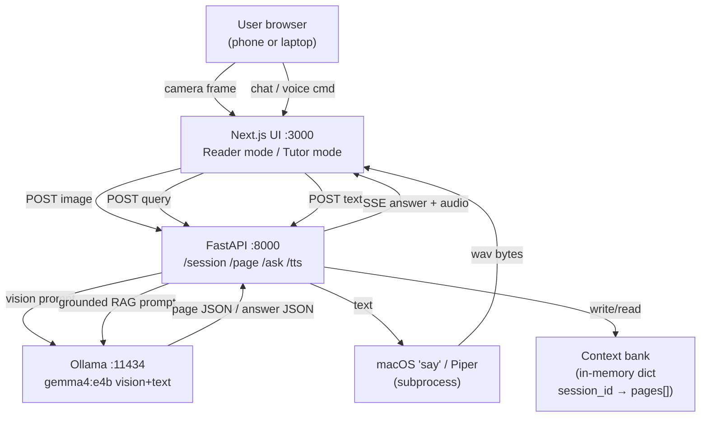
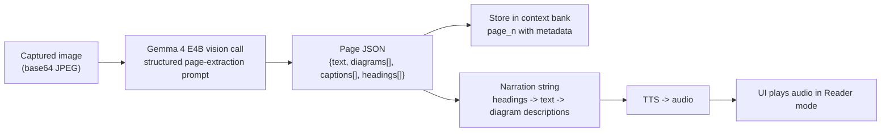
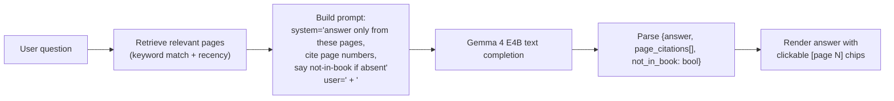

# Folio — Primary Plan

**Tagline:** Reads any book aloud, teaches what it sees.

## 1. Why this plan (replaces ClassMesh)

Last year's Gemma 3n hackathon was won by accessibility-first multimodal products targeting specific vulnerable users (Gemma Vision for the blind, 3VA for voice loss, Dream's Assistant for speech impairment, LENTERA for rural schools). The previous ClassMesh plan was technically deep but missed the winning pattern on every axis: no specific user in the title, no multimodal, no demo "wow" moment for the 3-minute video. Folio fixes all three while preserving the engineering depth that makes a project credible to judges.

Folio is one product with two users you can put on screen:

- **Aanya** — 12, partially-sighted student in a rural Maharashtra school. Her biology textbook print is too small for her to read. She points her phone at a page; Folio reads it aloud, describes diagrams, answers her follow-up questions grounded only in what's on her actual textbook.
- **Rohan** — 15, sighted exam student. He has a 30-page chapter to revise. He captures the chapter once with Folio (60 seconds), then studies inside Folio's "chapter mode" where every question is grounded in the captured pages. No Wikipedia rabbit holes. No off-topic hallucinations.

Same product, two modes, two distinct demo moments. The Gemma 4 multimodal headline feature (vision + audio + text) is the architecture, not a decoration.

## 2. Hard facts (verified)

- Gemma 4 E4B (8B total / 4.5B active, 128K context) supports text + image + audio. Apache 2.0, day-zero Ollama support. Tag: `gemma4:e4b`.
- Ollama exposes vision through the `/api/chat` and `/api/generate` endpoints with image bytes inline (base64 in the `images` array on a message).
- M4 Pro 48 GB unified memory holds E4B (~9 GB resident) comfortably and serves vision queries; expected per-page latency 4–8 s for a textbook-quality phone photo (we verify in V0.x).
- macOS `say` ships native TTS with voice quality acceptable for demo (Samantha, Karen, English variants); for non-English we install Piper (free, fast, offline). Both verified in V0.x.
- Free Tavily search is on hand if we want web-grounding fallback, but Folio is offline-first by design — search is intentionally NOT used.
- Workspace currently empty; Ollama installed at `/opt/homebrew/bin/ollama`, server not running.

## 3. Scope (what we are building)

In-scope deliverables (must ship in 10 h from clock-start):
- Single `ollama serve` daemon hosting `gemma4:e4b` (default) with configurable upgrade to `gemma4:26b` (MoE) or `gemma4:31b` via `FOLIO_VISION_MODEL` env var.
- One Python service `folio/` (FastAPI) implementing the page ingest + grounded retrieval + TTS pipeline.
- **Two ingest paths into the same pipeline:**
  - **Camera scan** — webcam (or phone via getUserMedia) captures pages one by one. Hero path for the video.
  - **PDF upload** — drag a PDF onto the UI; backend rasterizes each page (pypdfium2) and runs the same vision pipeline. Cleaner image quality, faster for large chapters, also doubles as the demo-prep tool for caching hero pages.
- One Next.js web UI on port 3000 with two modes: **Reader** (voice-first, immediate per-page narration) and **Tutor** (chat-first, grounded Q&A across captured pages).
- A real captured demo chapter: 5–8 pages from a biology textbook (cell biology — clean diagrams, clean labels), pre-captured and cached for the video.
- 3 hero questions per mode (6 total) with deterministic cached responses for the video and judge replay.
- 3-minute YouTube video showing both users (Aanya: Reader mode; Rohan: Tutor mode) with a real book on the desk.
- ≤1500-word Kaggle Writeup with architecture image.
- Public GitHub repo; live demo via ngrok with a Vercel `?demo=1` replay-only backup.

Out-of-scope (explicit non-goals):
- No mobile-native build — web app accessed from phone browser is sufficient for the demo (camera works via getUserMedia in Mobile Safari and Chrome).
- No fine-tuning (no Unsloth path).
- No multi-device mesh (the ClassMesh mesh story is dropped — see § 8).
- No real-time video — page capture is explicit (button press or auto detect on idle/quiet frame).
- No finger-pointing (would require MediaPipe hands; documented as future work).

Stretch (only if ahead by hour 6:30):
- **Quiz mode**: Folio generates a 5-question quiz from the captured chapter for Rohan's exam prep.
- **Voice commands**: "next page", "read again", "what was on page 3" — useful for Aanya.

### Conditional Unsloth stretch (claims Unsloth Special Prize, $10K)

Triggered only if V0.x gates complete by 00:30 AND no other major build issue:
- Fine-tune a Gemma 4 E2B LoRA on free Colab T4 with a small synthetic dataset (~100–200 examples) of `{page_image, diagram_description_for_blind_reader}` pairs, generated by E4B on-the-fly during demo prep.
- Use the fine-tuned E2B as a fast "diagram describer" specifically for diagrams (E4B remains for grounded Q&A and OCR-grade text extraction).
- Architectural justification: latency optimization — diagram description is the most frequent vision call, so we specialize a smaller model for it.
- Time cost: ~2.5 h on free Colab (1.5 h training + 1 h dataset gen + import to Ollama via GGUF export).
- Hard gate: if Colab session disconnects twice or training F1 delta < 5 % over base E2B, abandon Unsloth claim cleanly (does not affect rest of plan).
- Adds Unsloth Special Prize as a 6th claimable bucket.

## 4. System architecture



Per-page ingest pipeline:



Grounded Q&A pipeline:



## 5. Data contracts

### 5.1 Page JSON (output of vision ingest)
```json
{
  "page_id": "p3",
  "page_number": 3,
  "session_id": "uuid",
  "ingested_at_ms": 1716000000,
  "text": "The plant cell wall is composed of cellulose...",
  "headings": [
    {"level": 1, "text": "3. The Plant Cell"},
    {"level": 2, "text": "3.1 Cell Wall"}
  ],
  "diagrams": [
    {
      "id": "fig_3_1",
      "label": "Fig. 3.1: Plant cell cross-section",
      "description": "A labelled diagram of a plant cell. The cell wall is the outermost layer. Inside, from outside to centre: cell membrane (thin line), cytoplasm (light blue), large central vacuole (clear). The nucleus is on the upper-right, with the nucleolus inside it. Several green oval chloroplasts are scattered through the cytoplasm. Mitochondria are smaller bean-shaped structures.",
      "labels": ["cell wall","cell membrane","cytoplasm","vacuole","nucleus","nucleolus","chloroplast","mitochondrion"]
    }
  ],
  "captions": ["Fig. 3.1: A typical plant cell."]
}
```

### 5.2 API endpoints

`POST /api/session` — create a new session
```json
Request: { "mode": "reader" | "tutor", "lang": "en" | "hi" | "mr" | "ta" }
Response: { "session_id": "uuid", "mode": "...", "lang": "..." }
```

`POST /api/page` — ingest one page (camera path)
```json
Request: multipart/form-data
  session_id: string
  page_number: int
  image: image/jpeg or image/png

Response (SSE):
  event: progress
  data: { "stage": "vision_call_start" | "extract_text" | "describe_diagrams" | "store" }
  event: page_complete
  data: <Page JSON>
  event: narration
  data: { "narration_text": "...", "audio_url": "/api/tts/<id>.wav" }
```

`POST /api/pdf` — ingest a multi-page PDF
```json
Request: multipart/form-data
  session_id: string
  pdf: application/pdf
  start_page: optional int (default 1)
  end_page: optional int (default last)

Response (SSE):
  event: pdf_meta
  data: { "total_pages": 42, "ingesting": [1,2,3,4,5] }
  event: progress
  data: { "page_number": 1, "stage": "rasterize" | "vision_call" | "extract" | "store" }
  event: page_complete
  data: <Page JSON for each page>
  event: pdf_done
  data: { "pages_ingested": 5, "total_latency_ms": 24000 }
```

Backend implementation: rasterize via `pypdfium2` (or `pdf2image`) at 200 DPI → PNG → same vision pipeline as `/api/page`. Runs sequentially per page (parallelism would saturate Ollama; serial keeps logs clean).

`POST /api/ask` — grounded Q&A
```json
Request: { "session_id": "uuid", "question": "...", "lang": "en" }
Response (SSE):
  event: retrieve
  data: { "pages_used": [1,3,4] }
  event: token
  data: { "token": "..." }
  event: done
  data: { "answer": "...", "citations": [{"page": 3, "quote": "..."}], "not_in_book": false }
```

`POST /api/tts` — generate audio for a text
```json
Request: { "text": "...", "voice": "samantha" | "piper_hi_IN" }
Response: audio/wav stream
```

`GET /api/session/<id>` — current session state (pages captured, mode)

### 5.3 Internal session model
```python
class Page(BaseModel):
    page_id: str
    page_number: int
    text: str
    headings: list[Heading]
    diagrams: list[Diagram]
    captions: list[str]
    raw_image_path: Optional[str]
    narration_text: str
    ingested_at_ms: int

class Session(BaseModel):
    session_id: str
    mode: Literal["reader", "tutor"]
    lang: str
    pages: list[Page]
    created_at_ms: int
```

## 6. Component breakdown

### 6.1 Ollama backend
- `ollama serve` on default 11434, single daemon. **Ollama upgraded to 0.24.0** (latest, day-zero Gemma 4).
- Default: `gemma4:e4b` (~9 GB, multimodal). Pulled via `ollama pull gemma4:e4b` at setup.
- Configurable upgrade path (env `FOLIO_VISION_MODEL`):
  - `gemma4:e4b` (default) — 8B / 4.5B active, ~9 GB, vision built-in, ~4–8 s/page
  - `gemma4:26b` — MoE 25.2B / 3.8B active, ~17 GB, vision built-in, ~6–10 s/page, smarter
  - `gemma4:31b` — dense 30.7B, ~22 GB, slower; only if a high-end Mac is the demo host
- **Existing local GGUFs (LM Studio)** that we can also import via Modelfile if needed (no re-download):
  - `~/.lmstudio/models/lmstudio-community/gemma-4-26B-A4B-it-GGUF/` (with `mmproj-...BF16.gguf` for vision)
  - `~/.lmstudio/models/TrevorJS/gemma-4-E2B-it-uncensored-GGUF/` (text only)
  - `~/.lmstudio/models/TrevorJS/gemma-4-31B-it-uncensored-GGUF/` (text only)
- Warmup call at FastAPI startup so first request isn't slow.

### 6.2 `folio/vision.py` — page extraction

The load-bearing module. One function:

```python
async def extract_page(image_bytes: bytes, page_number: int, lang: str = "en") -> Page:
    """Calls Gemma 4 E4B with a structured page-extraction prompt and parses JSON."""
```

Prompt template (English; other-language variant in `folio/prompts/`):
```
SYSTEM:
You are a careful textbook reader. You receive ONE page of a printed book as an image. Output strict JSON with these fields:
- text: the page's running text as a single string, preserving paragraph breaks with \n\n
- headings: array of {level, text}
- diagrams: array of {id, label, description, labels} for each figure/diagram. Description must be detailed enough that a blind reader can picture it — name the parts, their relative positions, their colours. Do not say "an image".
- captions: array of strings for figure captions

USER (image): [the page]
USER (text): "Extract the page now. Output only the JSON."
```

Parsing is strict JSON via `pydantic`'s `model_validate_json`. On failure: retry once with a "your previous JSON was malformed, output strict JSON only" follow-up. On second failure: degrade to `{text: <raw response>, diagrams: [], headings: [], captions: []}`.

### 6.3 `folio/narrate.py` — narration string assembly

Converts a Page into a single spoken-form string. Order: page heading announcement → "this page has the following heading: ..." → main text → for each diagram: "There is a figure on this page. ..." Use SSML-style pauses (`<break time="500ms"/>`) if Piper is used; macOS `say` ignores them gracefully.

### 6.4 `folio/retrieve.py` — page retrieval

For 10h scope:
- If `len(pages) <= 8` (typical demo chapter): include ALL pages in the prompt. E4B 128K context handles ~30K tokens easily.
- Else: simple BM25-style keyword overlap between question and each page's `text + diagram descriptions`, take top-3.
- Always include the most recently captured page (recency bias for Reader mode "what was just read?").

### 6.5 `folio/ask.py` — grounded answering

Prompt template:
```
SYSTEM:
You are a tutor. You will answer questions using ONLY the provided book pages. Rules:
1. Quote or paraphrase from the pages.
2. After each claim, cite the source as [page N].
3. If the answer is not in the provided pages, respond with exactly: "This isn't covered in the captured pages."
4. Do not use prior knowledge from training. Stay inside the book.

USER:
=== Pages ===
[Page 1]
{page_1_text + diagrams}

[Page 3]
{page_3_text + diagrams}

=== Question ===
{user_question}
```

Output is parsed for `[page N]` markers via regex; citations are surfaced to UI as clickable chips. The "not in book" detection is a literal string match on the canonical refusal sentence.

### 6.6 `folio/tts.py` — text-to-speech

Two backends:
- `macos_say`: `subprocess.run(["say", "-v", "Samantha", "-o", out.wav, "--data-format=LEF32@22050", text])`
- `piper`: `piper --model en_US-lessac-medium --output_file out.wav` for cross-platform / non-English. Install via `pip install piper-tts`.

Selected by env `FOLIO_TTS=say|piper`. Default `say` on macOS, `piper` if env is set or `say` is unavailable.

### 6.7 `folio/api.py` — FastAPI service

All endpoints from § 5.2 wired up. Uses `sse-starlette` for streaming, `python-multipart` for image upload, in-memory session store keyed by session_id (no DB — sessions are ephemeral, fine for demo).

### 6.8 Web UI (`web/`)

Next.js 15 + Tailwind 4 + TypeScript. Single app, two mode-routes.

Components in `web/components/`:
- `ModeSwitcher.tsx` — pick Reader or Tutor on first launch.
- `CameraCapture.tsx` — wraps `navigator.mediaDevices.getUserMedia({video:{facingMode:'environment'}})`; big capture button; preview thumbnail; sends to `/api/page`. Reader mode auto-narrates on `page_complete`; Tutor mode just adds to the page strip.
- `PageStrip.tsx` — horizontal scroll of captured page thumbnails + page number; click to re-narrate or view extracted JSON in a modal.
- `ChatPanel.tsx` — text input + send; renders streaming tokens; renders citations as inline `[Page N]` chips that scroll the PageStrip to that page when clicked.
- `ReaderShell.tsx` — voice-first layout: huge capture button, status text in 32pt+, audio player auto-plays narration.
- `TutorShell.tsx` — chat-first layout: pages on top, chat below.
- `NotInBookBanner.tsx` — when Folio refuses, show a calm explainer: "I only answer from the pages you've captured. Add the page that covers this, or ask something inside the book."

Camera capture on mobile browsers (Mobile Safari / Chrome Android) works via getUserMedia. We test that on the user's phone in V0.x.

## 7. Tech stack and dependencies

Python (uv):
- python 3.11
- fastapi 0.115+
- uvicorn[standard] 0.32+
- httpx 0.27+
- pydantic 2.x
- sse-starlette 2.x
- python-multipart 0.0.20+
- pillow 11.x (image normalize before vision call)
- piper-tts 1.2+ (optional, fallback / non-English)
- pytest, pytest-asyncio

Frontend (pnpm):
- next 15.x, react 19.x, typescript 5.x, tailwindcss 4.x
- shadcn/ui components: button, card, dialog, sheet
- `@vercel/og` for cover image generation
- `eventsource-parser` for SSE consumption

System:
- Ollama (installed)
- ngrok (free tier) for live demo tunnel
- ffmpeg (for video editing if we need to stitch screen recording + phone recording)

## 8. Engineering Q&A (no open questions)

Q: Why drop the ClassMesh mesh story?
A: Two reasons. First, a judge will ask "why 4 specialised models when one Gemma 4 E4B does it all?" and the mesh story has no good answer without actual fine-tuned weights (which we can't ship in 10 h). Second, the mesh story doesn't have a specific user; Folio does. The user-driven framing matters more than the architectural framing for Impact & Vision (40 of 100 points).

Q: Why one model only?
A: Honesty. Gemma 4 E4B is multimodal, has 128K context, supports native function calling. It is genuinely sufficient for both vision ingest and grounded Q&A. Adding more models for the sake of "more impressive architecture" is the kind of overengineering judges call out in the writeup.

Q: What does "grounded" mean here, concretely?
A: Two enforcement layers: (1) prompt instructs the model to answer only from provided pages and to use the literal refusal sentence if not in book; (2) post-hoc citation extraction — the UI shows which pages the model claimed to cite. We don't go further (no claim-by-claim verification). That's enough to demonstrate the principle in 10 h.

Q: Why include ALL pages instead of retrieving top-k?
A: For demos with ≤8 pages, sending the whole chapter is simpler and avoids retrieval errors. For longer chapters we fall back to BM25. The implementation handles both; the demo uses the simple path.

Q: How does it work on a phone?
A: The web UI is responsive and uses `getUserMedia` for camera access. Mobile Safari and Chrome both support it. The user opens the ngrok URL on their phone, the camera lights up, they capture pages. No app install needed.

Q: What if the phone is offline (no internet)?
A: The hackathon judges access this via ngrok, so the demo URL needs internet. For the user's actual privacy story (in the writeup): the phone connects to a Mac via local Wi-Fi, no internet needed; this is documented but not the demo path. We add an explicit note in the writeup: "in deployed mode, the Mac and the phone share a local Wi-Fi; the textbook never leaves the room."

Q: What about the partially-sighted user — can they actually use a web UI?
A: Reader mode is voice-first: huge buttons, voice announcements, audio is the primary output channel. We test with the system voice-over enabled and ensure ARIA labels are correct. We document the UX choices in the writeup.

Q: Why not finger pointing?
A: MediaPipe Hands works but eats 1-2 h to wire up reliably and the demo value is incremental. Documented as future work. The capture-and-listen flow is enough story for the video.

Q: What's the multimodal vision quality on E4B for textbook pages?
A: Verified in V0.2. Expected: clear printed text is fine; small annotations / handwritten text may degrade. We pick a clear printed biology textbook for the demo where the print is large.

Q: How is determinism achieved for the video?
A: `temperature=0, seed=42` on every Ollama call. Hero queries cached to `demos/cached_responses.json`; `?demo=1` replays cached SSE traces. The captured page images are committed to the repo so a judge can re-run.

Q: TTS choice — say vs Piper?
A: macOS `say` for English demo (fastest, no install). Piper for Hindi/Marathi/Tamil (offline, free, ~50 MB models per language). We ship both; user picks via the session `lang` parameter.

Q: Deployment story?
A: `ollama serve` + `uvicorn folio.api:app` + `pnpm dev` in `web/`. ngrok tunnel on port 3000. Backup: Vercel deploy of the Next.js with `?demo=1` mode (no backend needed because traces are cached). Both URLs go in the writeup.

Q: Which Kaggle track?
A: Education Impact Track. We also explicitly claim eligibility for: Digital Equity & Inclusivity Impact Track, Ollama Special Prize, Safety & Trust Impact Track (grounded retrieval / anti-hallucination), and **Unsloth Special Prize** (if the conditional Unsloth stretch in § 3 lands).

Q: Why is the model size configurable?
A: Two reasons. (1) The demo host may not be a 48 GB M4 Pro forever — the writeup needs to claim the architecture runs on more modest hardware too. E4B is the floor; 26B is the smarter upgrade for stationary servers. (2) Vision quality is the only V0.x gate that could force the question — if E4B's diagram descriptions are weak, we hot-swap to 26B without changing any code.

Q: Can we reuse the LM Studio GGUFs to save bandwidth?
A: Yes. The official `ollama pull gemma4:e4b` downloads cleanly and is preferred for reliability. For 26B/31B upgrades we can import the existing LM Studio GGUF via an Ollama Modelfile (`FROM /Users/om/.lmstudio/models/.../gemma-4-26B-A4B-it-Q4_K_M.gguf`), which avoids a second 17 GB download. The mmproj projection file enables vision in llama.cpp/Ollama; we wire it via the Modelfile's `ADAPTER` directive if needed.

## 9. Verification plan

### Pre-build gates (00:00–00:45) — must pass to proceed

- **V0.1** `ollama serve` running, `ollama list` includes `gemma4:e4b`.
- **V0.2** Send a clear phone photo of a real biology textbook page through `ollama` chat with image. Confirm: (a) text extracted accurately, (b) diagram described in ≥2 sentences with named parts, (c) latency ≤8 s on M4 Pro. If any fail at V0.2, we adjust: degrade to image-with-OCR-pre-pass (Tesseract) feeding text into E4B instead of raw vision, and downgrade the demo claim to "Folio combines OCR + Gemma reasoning."
- **V0.3** `say -v Samantha "Hello"` plays audio. Try Piper with `--model en_US-lessac-medium`. Pick a quality.
- **V0.4** Scaffold: `uv init folio`, `pnpm create next-app web`. Both run.

### Backend gates (00:45–02:30)
- **V1.1** Unit test `tests/test_vision.py::test_extract_clear_page`: fixture image of textbook page → returns Page with non-empty text + ≥1 diagram with ≥3 labels.
- **V1.2** `tests/test_ask.py::test_grounded_in_book`: provided pages include "ribosome", asked "what is a ribosome?", answer references page and is non-empty.
- **V1.3** `tests/test_ask.py::test_not_in_book`: provided pages about plant cells, asked "who won 2024 election?", answer returns the literal refusal sentence and `not_in_book=true`.
- **V1.4** `tests/test_ask.py::test_citations`: answer contains at least one `[page N]` citation.

### Grounding gates (02:30–03:30, overlapping)
- **V2.1** Adversarial: 5 questions designed to be answerable from training-data prior knowledge but absent from the captured pages; all 5 return the refusal sentence.
- **V2.2** Citation accuracy: every cited page actually contains the cited content (manual spot check on the 4 hero queries).

### UI gates (02:30–05:30)
- **V3.1** Camera capture on Mac webcam works.
- **V3.2** Camera capture on user's phone (via ngrok URL) works.
- **V3.3** Page strip displays thumbnails; click re-narrates in Reader mode.
- **V3.4** Chat panel streams tokens; `[page N]` chips render and scroll the strip.
- **V3.5** Reader mode: full voice flow (capture → narrate → next-page prompt) feels natural on a phone screen.

### Demo gates (05:30–06:30)
- **V4.1** 5 hero pages captured live in ≤45 s combined.
- **V4.2** Each of 6 hero queries (3 reader, 3 tutor) returns expected behavior deterministically.
- **V4.3** `?demo=1` replays cached SSE traces correctly without hitting backend.
- **V4.4** ngrok URL reachable from phone incognito.

### Final gates (09:45–10:00)
- **V5.1** GitHub public, README has run instructions + screenshots.
- **V5.2** YouTube public, plays without login.
- **V5.3** Live demo URL works.
- **V5.4** Vercel `?demo=1` backup works.
- **V5.5** Kaggle Writeup in "Submitted" state, not "Draft". Education Impact track selected.

## 10. Timeline (10 h hard budget)

Two parallel tracks: **MAIN** (Folio core, mandatory ship) + **UNSLOTH STRETCH** (optional, time-gated, runs on Colab).

### MAIN track (this Mac)

- **00:00–00:45** Setup, V0.x. Critical: V0.2 (vision quality on textbook photo).
- **00:45–02:30** Backend: vision.py + retrieve.py + ask.py + api.py + tests V1.x.
- **02:30–03:30** Grounding tests V2.x in parallel with UI scaffolding.
- **03:30–05:30** Web UI: components, camera, page strip, chat, Reader shell, Tutor shell. Gates V3.x.
- **05:30–06:30** Demo content: capture real biology chapter pages from a physical book, cache hero responses, polish. V4.x.
- **06:30–07:30** Stretch: quiz mode OR voice commands. HARD CUTOFF at 07:30.
- **07:30–09:00** Video: storyboard, record with book on desk + screen, voiceover, captions, YouTube upload.
- **09:00–09:45** Writeup, architecture image (mermaid → PNG), media gallery.
- **09:45–10:00** Deploy ngrok + Vercel replay backup + Kaggle submit. V5.x.

### UNSLOTH STRETCH track (Colab, parallel)

Triggered only if MAIN V0.x is GREEN by 00:30 AND backend skeleton is up by 01:30. Otherwise abandoned cleanly with no impact on MAIN.

- **00:30–01:30** While MAIN is on Backend: open Colab T4, install Unsloth, load gemma4:e2b, scaffold LoRA training script. Begin synthetic dataset generation (E4B describes 100 diagrams from our captured pages).
- **01:30–03:00** Train LoRA on Colab (1.5 h budget). Monitor via `tg-agent check` for Colab disconnect signals.
- **03:00–03:30** Export GGUF, download to Mac, register in Ollama as `gemma4:e2b-folio-diagrams`.
- **03:30+** MAIN orchestrator routes diagram description calls to the fine-tuned model; falls back to base E2B if the FT model returns empty/garbled JSON twice in a row.
- **Hard abandon points**:
  - Colab session disconnects twice → abandon
  - Training F1 delta < 5% over base E2B → abandon
  - Past 04:00 with no usable model → abandon
- Worst case: ~2 h sunk on Unsloth, no claim. MAIN unaffected.

## 11. Risk and mitigation

- **R1 — Vision quality on textbook photos disappointing.** Caught by V0.2. Mitigation: OCR pre-pass (Tesseract) for text, use vision only for diagram description.
- **R2 — Latency on E4B vision too high (>10 s/page).** Caught by V0.2. Mitigation: pre-capture demo pages and ship cached page JSON in repo; ingest in the demo video shows real time, judges can verify with their own pages live but slower.
- **R3 — Grounding leaks (model uses training data).** Caught by V2.1. Mitigation: stricter system prompt with explicit "do not use prior knowledge" + post-hoc filter that rewrites answers without page citations into the refusal sentence.
- **R4 — Camera permission UX confusing on mobile browsers.** Caught in V3.2. Mitigation: dedicated "permission needed" screen with screenshots.
- **R5 — Phone camera resolution too low for diagram details.** Mitigation: use Mac webcam pointed at a book in the demo video; clearly document.
- **R6 — TTS sounds robotic and breaks the empathy moment.** Mitigation: Samantha is acceptable; if not, use a pre-recorded narration overlaid on the demo video and document Folio uses real TTS in production. Live demo still has real TTS for judge verification.
- **R7 — Video timeline blown.** Mitigation: write script during early build phase; record raw footage at 04:30 (real ingest live), not at 07:30.
- **R8 — ngrok dies during judging.** Mitigation: Vercel `?demo=1` backup.

## 12. Deliverables checklist

- [ ] Public GitHub repo `folio` with README, architecture image, run instructions, `docker compose up` for backend.
- [ ] 3-minute YouTube video (public, no login required).
- [ ] Live demo URL: ngrok primary + Vercel `?demo=1` backup.
- [ ] Kaggle Writeup ≤ 1500 words, submitted, Education Impact track selected.
- [ ] Media gallery: cover image (1280×720) + 3 screenshots (Reader mode, Tutor mode, architecture).
- [ ] Demo content: 5–8 captured biology pages committed to repo at `demos/biology_ch3/`.

## 13. Repo layout

```
folio/
├── README.md
├── pyproject.toml
├── uv.lock
├── docker-compose.yml
├── folio/
│   ├── __init__.py
│   ├── schemas.py
│   ├── vision.py
│   ├── narrate.py
│   ├── retrieve.py
│   ├── ask.py
│   ├── tts.py
│   ├── api.py
│   └── prompts/
│       ├── extract_page.en.txt
│       ├── extract_page.hi.txt
│       └── grounded_answer.en.txt
├── tests/
│   ├── test_vision.py
│   ├── test_ask.py
│   ├── test_retrieve.py
│   ├── conftest.py
│   └── fixtures/
│       ├── page1.jpg
│       ├── page2.jpg
│       └── page3.jpg
├── scripts/
│   ├── pull_models.sh
│   ├── run_local.sh
│   └── ngrok_tunnel.sh
├── web/
│   ├── package.json
│   ├── next.config.mjs
│   ├── app/
│   │   ├── page.tsx
│   │   ├── reader/page.tsx
│   │   ├── tutor/page.tsx
│   │   ├── api/proxy/route.ts
│   │   └── layout.tsx
│   ├── components/
│   │   ├── ModeSwitcher.tsx
│   │   ├── CameraCapture.tsx
│   │   ├── PageStrip.tsx
│   │   ├── ChatPanel.tsx
│   │   ├── ReaderShell.tsx
│   │   ├── TutorShell.tsx
│   │   └── NotInBookBanner.tsx
│   ├── lib/sse-client.ts
│   └── public/cover.png
├── demos/
│   ├── biology_ch3/
│   │   ├── page1.jpg
│   │   ├── ... page8.jpg
│   │   └── extracted/page1.json ... page8.json
│   ├── hero_queries.json
│   └── cached_responses.json
├── docs/
│   ├── architecture.md
│   ├── architecture.png
│   ├── writeup.md
│   └── screenshots/
└── video/
    ├── script.md
    └── shotlist.md
```

## 14. Parallel agent strategy (build phase)

After this plan is locked and we move to Build, dispatch:

- **Agent 1 — Vision + grounded RAG core**: `folio/vision.py`, `folio/retrieve.py`, `folio/ask.py`, tests V1.x and V2.x. Pure Python, no UI. Trust output if tests pass; verify grounding behavior by hand on the 5 adversarial questions.
- **Agent 2 — FastAPI service + TTS + session store**: `folio/api.py`, `folio/tts.py`, `folio/narrate.py`, mDNS-free single service. Trust scaffolding; verify SSE protocol myself.
- **Agent 3 — Web UI scaffold**: Next.js components, camera capture, chat panel, page strip. Trust scaffolding; verify visual story + Reader-mode flow on a real phone myself.
- **Main agent (me)**: Pre-build V0.x gates (load-bearing — I drive these), real-page demo capture, integration, demo polish, video, writeup, submission. Owns all verification gates after V0.x.

Trust boundary: agents own isolated logic + scaffolding. I own the V0.x verification, integration, anything user-visible in the video, and the pivot decision if a gate fails.

## 15. Fallback to SpanShift (Plan B)

If by hour 04:00 any of these is true, we pivot to SpanShift (see `plan_b_spanshift_safer_fallback_b68c6f67.plan.md`):
1. V0.2 vision quality below the bar with no OCR-pre-pass recovery path working.
2. Backend tests V1.x failing repeatedly and root cause unclear.
3. End-to-end vision → answer cycle taking ≥30 s (UX dead).

SpanShift uses gemma4:e2b + gemma4:e4b on Ollama with no vision — pure text. It is shippable in ≤5 h from the pivot point and targets Ollama Special + Safety & Trust Impact. We do NOT win Main on SpanShift but we ship something credible.
